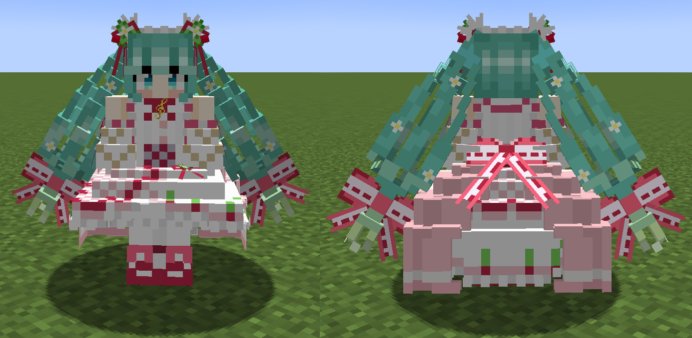
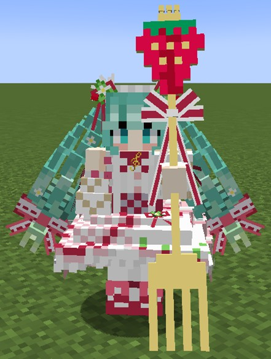

Language: 　**English**　|　[日本語](./README_jp.md)

# StrawberryMiku (苺ミク)
This is "Strawberry Miku (苺ミク)", the avatar for [Figura](https://modrinth.com/mod/figura), the skin mod for [Minecraft](https://www.minecraft.net/en-us).

Target Figura versions: [0.1.1](https://modrinth.com/mod/figura/version/0.1.1+1.20.1-0f8b7a9)~

## Features
- Replaces the trident model with the original one.

  

- The hair flutters with the player's movement.

  

## How to use
Figura is available in [Forge](https://files.minecraftforge.net/net/minecraftforge/forge/), [Fabric](https://fabricmc.net/), and [Quilt](https://quiltmc.org/).

1. Install the mod loader which you want to use and make the mods available.
2. Install [Figura](https://modrinth.com/mod/figura). Note the mod dependencies.
3. Go to the download page for the character which you want to download.
4. Click green "**<>Code**" button at the top of the page and "**Download ZIP**" to download the repository files (or clone this repository).
5. Extract the file if it is a zipped file.
6. Put avatar files at `<minecraft_instance_directory>/figura/avatars/`.
   - The directory will automatically generated after launching the game with Figura installed. You can also create it manually if it doesn't exist.
7. Open the Figura menu (Δ mark) from the game menu.
8. Select the avatar from the avatar list at the left of the Figura menu.
9. Sets your permission if you need.
10. Other Figura players can see your avatar after uploading your avatar to the Figura server.

## Notes
- I'm not responsible for any damages caused by using this avatar.
- This avatar is designed for work with no resource pack and no other mods are installed. An unexpected issue may occurs when you use it with any resource packs and mods (texture and armor inconsistencies, etc.). However, I won't support in these cases.
- Please [report an issue](https://github.com/Gakuto1112/StrawberryMiku/issues) if you find it.

## References
- [苺ミク【MMDモデル配布】 _ 不沈空母 さんのイラスト - ニコニコ静画 (イラスト)](https://seiga.nicovideo.jp/seiga/im11019402)
- [苺やフリルに彩られた豪華な衣装に注目！15周年記念にちなんだ”苺”モチーフのキュートな初音ミクがスケールフィギュア化！ _ 電撃ホビーウェブ](https://hobby.dengeki.com/news/1658674/)