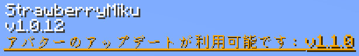

Language: 　**English**　|　[日本語](./README_jp.md)

# StrawberryMiku (苺ミク)
<!-- DESCRIPTION_START -->
This is "Strawberry Miku (苺ミク)", the avatar for [Figura](https://modrinth.com/mod/figura), the skin mod for [Minecraft](https://www.minecraft.net/en-us).

Target Figura version: [0.1.5](https://modrinth.com/mod/figura/version/0.1.5b+1.21.4)
<!-- DESCRIPTION_END -->

## Features
- Replaces the trident model with the original one.

  

- The hair flutters with the player's movement.

  

## Avatar version display
From v1.1.0, when the action wheel is open, the version of avatar currently in use and whether it has been updated are displayed in the upper left corner of the screen.

Updates are automatically checked once a day, but can also be done manually via the action wheel (default: B key).

A notification will be sent when a new avatar version is available. You can get the download link for the latest version from the action wheel, which you can access from your browser.

> [!IMPORTANT]
> To check for avatar updates, you must turn on "Allow Networking" and add `api.github.com` to the Network Filter from Figura settings!

> [!CAUTION]
> It is DANGEROUS to use a network filter other than "Whitelist" when activating Figura's Networking Feature. Although this avatar uses secure links, there is no guarantee that links used by other players' avatars are secure. I'm not responsible for any damages caused by using this feature.

> [!WARNING]
> If you repeatedly check for updates in a short period of time, GitHub will impose a temporary restriction and avatar scripts will not be able to check for updates for a while.

## How to use
Figura is available in [Forge](https://files.minecraftforge.net/net/minecraftforge/forge/), [Fabric](https://fabricmc.net/) and [NeoForge](https://neoforged.net/).

1. Install the mod loader which you want to use and make the mods available.
2. Install [Figura](https://modrinth.com/mod/figura). Note the mod dependencies.
3. Go to the [release page](https://github.com/Gakuto1112/StrawberryMiku/releases).
   - You can also go there from the right side of [the repository's home page](https://github.com/Gakuto1112/StrawberryMiku).
4. Download the avatar of your choice that attached to "Assets" section of the release notes.
5. Unzip the zipped file and take the avatar data inside this.
6. Put avatar files at `<minecraft_instance_directory>/figura/avatars/`.
   - The directory will automatically generated after launching the game with Figura installed. You can also create it manually if it doesn't exist.
7. Open the Figura menu (Δ mark) from the game menu.
8. Select the avatar from the avatar list at the left of the Figura menu.
9. Sets your permission if you need.
10. Other Figura players can see your avatar after uploading your avatar to the Figura server.
    - **If your Minecraft is Pirated (cracked, unlicensed, free), you cannot upload your avatar.** This is a Figura specification and I cannot help you with this.

## Notes
- I'm not responsible for any damages caused by using this avatar.
- This avatar is designed for work with no resource pack and no other mods are installed. An unexpected issue may occurs when you use it with any resource packs and mods (texture and armor inconsistencies, etc.). However, I may not support you in these cases.
- Please [report an issue](https://github.com/Gakuto1112/StrawberryMiku/issues) if you find it.
- Please contact me via [Discussions](https://github.com/Gakuto1112/StrawberryMiku/discussions) or [Discord](https://discord.com/) if you want to do for my avatars. My Discord name is "vinny_san" and display name is "ばにーさん". My display name in [Figura Discord server](https://discord.gg/figuramc) is "BunnySan/ばにーさん".

## References
- [苺ミク【MMDモデル配布】 _ 不沈空母 さんのイラスト - ニコニコ静画 (イラスト)](https://seiga.nicovideo.jp/seiga/im11019402)
- [苺やフリルに彩られた豪華な衣装に注目！15周年記念にちなんだ”苺”モチーフのキュートな初音ミクがスケールフィギュア化！ _ 電撃ホビーウェブ](https://hobby.dengeki.com/news/1658674/)
