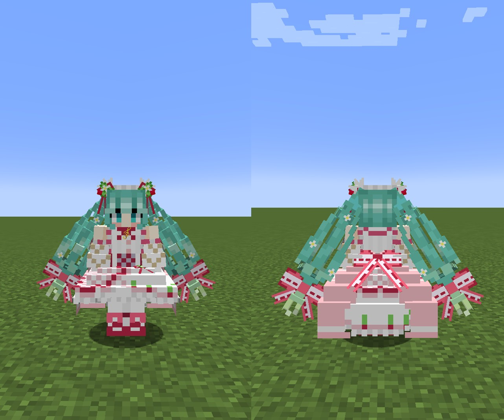

# !!! 重要なお知らせ VERY IMPORTANT NOTES !!!
（2023/7/16 16:40 JST 更新）

本日未明（2023/7/16 1:00 JST 前後）、突如として、**Figuraが削除されました**。Figuraの所有者（Francielly）が自身の不適切行為に対する除名処分の腹いせにmod本体、modのGitHubレポジトリ、Discordのコミュニティなどを勝手に全て削除したと考えられます。mod本体やコミュニティは全て削除されましたが、Figuraクラウドは管理者が別であるため、現在でも機能しています。現在、残りのFigura開発者・コミュニティ管理者が削除されたmodデータやコミュニティを修復しています。

[内部告発文書](https://docs.google.com/document/u/0/d/1pfy17co5ngaHMVksFrAB6FTeJgeh1EKsGmDLzo1qgIE/mobilebasic?pli=1)

***

# StrawberryMiku
MinecraftのスキンMod「[Figura](https://modrinth.com/mod/figura)」向けスキン「StrawberryMiku（苺ミク）」です。

対応Figuraバージョン：[**0.1.1**](https://modrinth.com/mod/figura/version/0.1.1+1.20.1-0f8b7a9)

## 特徴
- トライデントが専用のモデルに置き換えられます。

  

- プレイヤーの移動に合わせて髪がたなびきます。

  

## 使用方法
1. マインクラフトに[Fabric](https://fabricmc.net/)をインストールし、[Fabric API](https://www.curseforge.com/minecraft/mc-mods/fabric-api)と[Figura 0.1.1](https://modrinth.com/mod/figura/version/0.1.1+1.20.1)を追加します。各Modの依存関係にご注意ください。
2. ページ上部の緑色のボタン「**Code**」から「**Download ZIP**」からこのレポジトリのファイルをダウンロードします。（または、このレポジトリをクローンします。）
3. 圧縮ファイルの場合は展開します。
4. ``<マインクラフトのゲームフォルダ>/figura/avatars/``にアバターのデータを配置します。
   - フォルダはFiguraを追加したマインクラフトを一度起動すると自動的に生成されます。ない場合は手動で作成しても構いません。
5. ゲームメニューからFiguraメニュー（Δマーク）を開き、画面左のアバターリストから「Strawberry Miku」を選択します。
6. 必要に応じて権限設定をして下さい。
7. アバターをサーバーにアップロードすると、他のFiguraプレイヤーもあなたのアバターを見ることができます。

## おことわり
私（[Gakuto1112](https://github.com/Gakuto1112)）は、初音ミクやボーカロイドに関しての知識はあまりありません。今回も、ただ、Googleにおすすめのネット記事と表示されたのを見て、いいなと思って作っただけです。その辺りはご了承下さい。

## 参考
- [苺ミク【MMDモデル配布】 _ 不沈空母 さんのイラスト - ニコニコ静画 (イラスト)](https://seiga.nicovideo.jp/seiga/im11019402)
- [苺やフリルに彩られた豪華な衣装に注目！15周年記念にちなんだ”苺”モチーフのキュートな初音ミクがスケールフィギュア化！ _ 電撃ホビーウェブ](https://hobby.dengeki.com/news/1658674/)