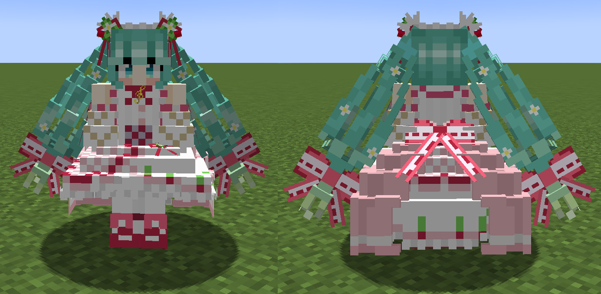

<!-- $inject(locale_link) -->

# StrawberryMiku (苺ミク)
This is "Strawberry Miku (苺ミク)", the avatar for [Figura](https://modrinth.com/mod/figura), the skin mod for [Minecraft](https://www.minecraft.net/en-us).

Target Figura version: [0.1.4](https://modrinth.com/mod/figura/version/0.1.4+1.20.4)

## Features
- Replaces the trident model with the original one.

  

- The hair flutters with the player's movement.

  

<!-- $inject(how_to_use) -->

#### Additional note
In addition to the avatar download method described here, you can also download avatar files from the "Releases" section on the right side of the repository's top page. A zip file of each avatar is attached to the "Assets" section of each release note.

<!-- $inject(notes) -->

## References
- [苺ミク【MMDモデル配布】 _ 不沈空母 さんのイラスト - ニコニコ静画 (イラスト)](https://seiga.nicovideo.jp/seiga/im11019402)
- [苺やフリルに彩られた豪華な衣装に注目！15周年記念にちなんだ”苺”モチーフのキュートな初音ミクがスケールフィギュア化！ _ 電撃ホビーウェブ](https://hobby.dengeki.com/news/1658674/)