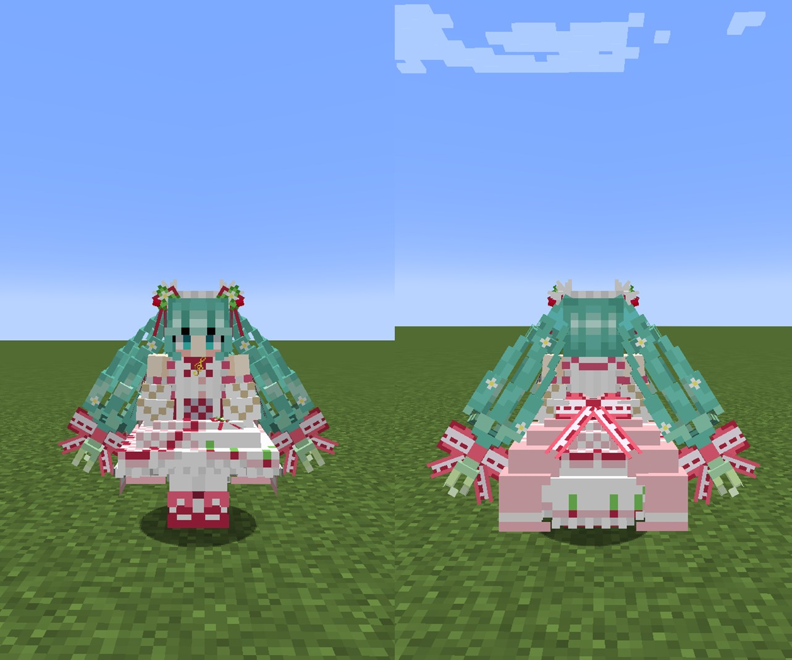
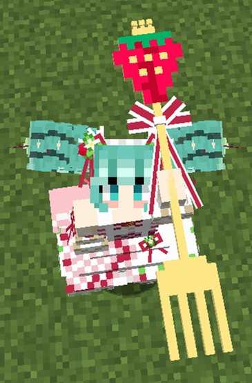

# StrawberryMiku
MinecraftのスキンMod「Figura」向けスキン「StrawberryMiku（苺ミク）」です。

対応Figuraバージョン：[**0.1.0-rc9**](https://www.curseforge.com/minecraft/mc-mods/figura/files/4007916)

## 特徴
- トライデントが専用のモデルに置き換えられます。

  

- プレイヤーの移動に合わせて髪がたなびきます。

  

## おことわり
私（[Gakuto1112](https://github.com/Gakuto1112)）は、初音ミクやボーカロイドに関しての知識はあまりありません。今回も、ただ、Googleにおすすめのネット記事と表示されたのを見て、いいなと思って作っただけです。その辺りはご了承下さい。

## 参考
- [苺ミク【MMDモデル配布】 _ 不沈空母 さんのイラスト - ニコニコ静画 (イラスト)](https://seiga.nicovideo.jp/seiga/im11019402)
- [苺やフリルに彩られた豪華な衣装に注目！15周年記念にちなんだ”苺”モチーフのキュートな初音ミクがスケールフィギュア化！ _ 電撃ホビーウェブ](https://hobby.dengeki.com/news/1658674/)